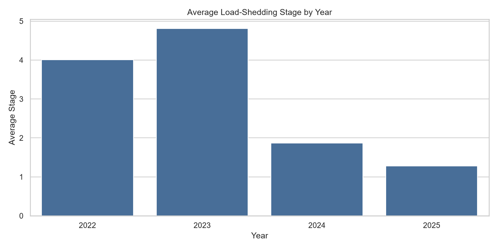
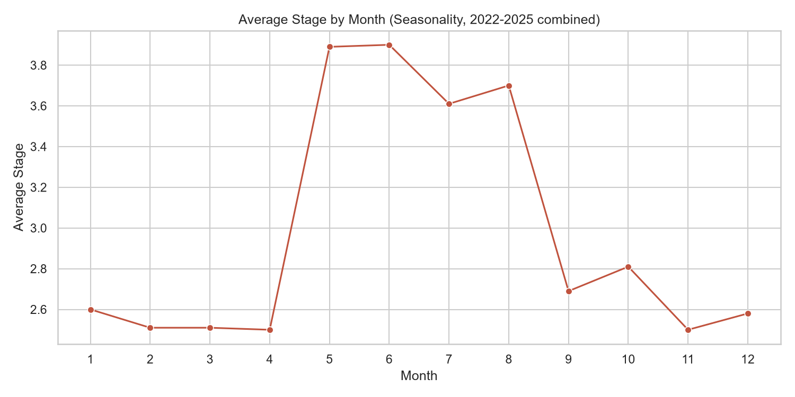
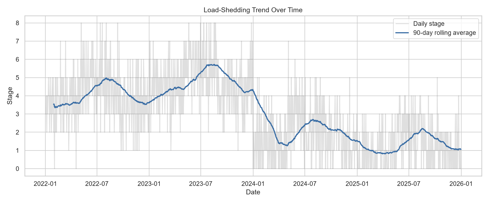

# Load-Shedding Business Cost Index 🇿🇦

An end-to-end data analytics project measuring how South African load-shedding
severity has changed from 2022–2025, whether the "winter is worse" assumption
actually holds up, and what it's costing small businesses in estimated lost
revenue.

**Author:** Diya Lakha
**Tech stack:** SQL (SQLite) · Python (pandas, matplotlib, seaborn) · Jupyter Notebook

---

## The problem

Load-shedding affects almost every household and business in South Africa, yet
there's surprisingly little accessible, data-backed analysis of *how much it has
actually improved or worsened over time*, and what that means in real financial
terms. This project builds a small but complete analytics pipeline — from raw
data through SQL analysis to a written narrative — to answer that.

## Key findings

| Year | Avg. Stage | Hours Without Power | Est. Cost to a Small Business (ZAR) |
|------|-----------|---------------------|--------------------------------------|
| 2022 | 4.01 | 2,928 | R2,488,800 |
| 2023 | 4.81 | 3,508 | R2,981,800 |
| 2024 | 1.87 | 1,366 | R1,161,100 |
| 2025 | 1.28 | 932 | R792,200 |

- **Winter is measurably worse than summer** — average stage 3.77 in winter vs. 2.59
  in summer across the full period.
- **2023 was the most severe year**, consistent with public reporting of it being
  the worst year on record nationally, before a marked improvement from 2024 onward.
- Over the full four-year period, a small business could face an estimated
  **R7.4 million in cumulative lost revenue** from 8,734 hours without power
  (see the cost assumption below).

*(These specific numbers are generated from the sample dataset included in this
repo — see "About the data" below. Re-run the pipeline with real data to update them.)*





## About the data

The dataset (`data/eskom_stages.csv`) used to produce the figures above is
**illustrative sample data**, generated by `scripts/generate_sample_data.py`.
It's modelled on publicly reported national trends (the severity of 2022–2023,
the improvement through 2024–2025, and worse winters), but the exact daily
values are synthetic — built so the *entire pipeline* could be built and
demonstrated without needing an API key on day one.

To use real data: register for a free key at the
[EskomSePush API](https://esp.info/) and run `scripts/fetch_live_data.py`, which
appends real daily status to a live dataset. The rest of the pipeline (schema,
SQL queries, notebook) works unchanged with real data — that's a deliberate
design choice so the project is honest about its current data source while
staying genuinely extensible.

The estimated business cost figure uses a documented, adjustable assumption of
**R850 in lost revenue per hour without power** (till systems down, card
machines offline, stock spoilage, lost foot traffic) — set in
`scripts/build_database.py`. Change `COST_PER_HOUR_ZAR` to model a different
business size or sector.

## Project structure

```
load-shedding-analytics/
├── data/
│   └── eskom_stages.csv          # sample dataset (generated)
├── sql/
│   ├── schema.sql                # database table definition
│   └── queries.sql               # the analytical SQL queries used
├── scripts/
│   ├── generate_sample_data.py   # builds the sample dataset
│   ├── fetch_live_data.py        # optional: pulls real data from EskomSePush API
│   └── build_database.py         # loads CSV into SQLite with cost calculations
├── notebooks/
│   └── analysis.ipynb            # full analysis, charts, and narrative
├── requirements.txt
└── README.md
```

## How to run it yourself

```bash
# 1. Create and activate a virtual environment
python -m venv venv
source venv/bin/activate        # Windows: venv\Scripts\activate

# 2. Install dependencies
pip install -r requirements.txt

# 3. Generate the sample dataset
python scripts/generate_sample_data.py

# 4. Build the SQLite database
python scripts/build_database.py

# 5. Open notebooks/analysis.ipynb in VS Code or Jupyter and run all cells
```

## Skills demonstrated

- **SQL**: aggregation, grouping, `CASE`-style seasonal logic, and a window
  function (90-day rolling average) — see `sql/queries.sql`.
- **Python / pandas**: data generation, cleaning, reshaping, and joining SQL
  results into analysis-ready DataFrames.
- **Data visualization**: matplotlib/seaborn charts designed to answer specific
  questions, not just "show the data."
- **Data storytelling**: every query maps to a real business question, and the
  README leads with findings rather than code.
- **Honest data practices**: clear documentation of assumptions, synthetic vs.
  real data, and a defined path to upgrade to a live data source.

## Possible next steps

- Swap in real EskomSePush historical data once accumulated via `fetch_live_data.py`.
- Add a Power BI or Tableau dashboard on top of `load_shedding.db` for interactive filtering.
- Break the national stage down by metro/municipality if a suitable public dataset is found.
- Add a simple statistical test (e.g. t-test) to formally confirm the winter/summer difference is significant, not just visually apparent.

---

*This project was built as part of a personal portfolio for data analytics job
applications. Feedback and suggestions welcome.*
